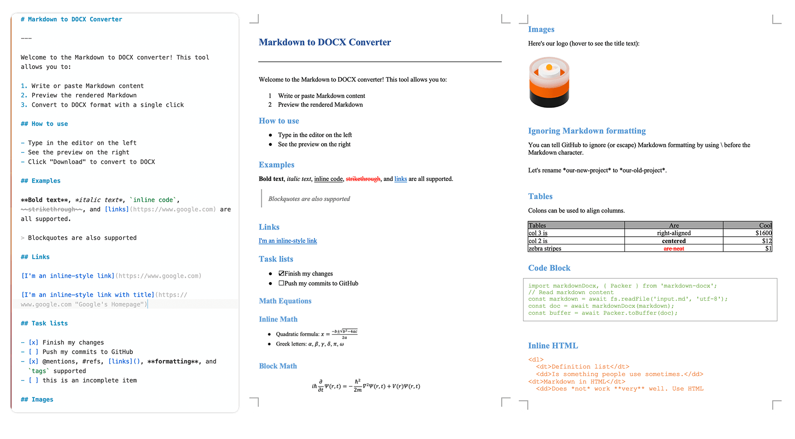

# markdown-docx

Convert Markdown files to DOCX format with support for both browser and Node.js environments.

将 Markdown 文件转换为 DOCX 格式，支持浏览器和 Node.js 环境。

[](https://www.npmjs.com/package/markdown-docx)
[](https://github.com/vace/markdown-docx/blob/main/LICENSE)

## Online Demo

[Markdown to DOCX Converter](https://md-docx.vace.me)

## Features



- 📝 Convert Markdown to DOCX format with high fidelity
- 🖼️ Support for images (with automatic downloading)
- 📋 Support for tables, lists, code blocks, and other Markdown elements
- 🔗 Hyperlinks and footnotes support
- 💅 Customizable styling options
- 🌐 Works in both browser and Node.js environments
- 🖥️ Command-line interface available

## Installation

```bash
# Using npm
npm install markdown-docx

# Using yarn
yarn add markdown-docx

# Using pnpm
pnpm add markdown-docx
```

## Basic Usage

### Node.js

```javascript
import fs from 'node:fs/promises';
import markdownDocx, { Packer } from 'markdown-docx';

async function convertMarkdownToDocx() {
  // Read markdown content
  const markdown = await fs.readFile('input.md', 'utf-8');
  
  // Convert to docx
  const doc = await markdownDocx(markdown);
  
  // Save to file
  const buffer = await Packer.toBuffer(doc);
  await fs.writeFile('output.docx', buffer);
  
  console.log('Conversion completed successfully!');
}

convertMarkdownToDocx();
```

### Browser

```javascript
import markdownDocx, { Packer } from 'markdown-docx';

async function convertMarkdownToDocx(markdownText) {
  // Convert to docx
  const doc = await markdownDocx(markdownText);
  
  // Generate blob for download
  const blob = await Packer.toBlob(doc);
  
  // Create download link
  const url = URL.createObjectURL(blob);
  const a = document.createElement('a');
  a.href = url;
  a.download = 'document.docx';
  a.click();
  
  // Clean up
  URL.revokeObjectURL(url);
}

// Example usage with a textarea
document.getElementById('convert-btn').addEventListener('click', () => {
  const markdown = document.getElementById('markdown-input').value;
  convertMarkdownToDocx(markdown);
});
```

## Advanced Usage

### Using the MarkdownDocx Class

For more control over the conversion process, you can use the `MarkdownDocx` class directly:

```javascript
import { MarkdownDocx, Packer } from 'markdown-docx';
import fs from 'node:fs/promises';

async function convertWithOptions() {
  const markdown = await fs.readFile('input.md', 'utf-8');
  
  // Create instance with options
  const converter = new MarkdownDocx(markdown)
  
  // Generate document
  const doc = await converter.toDocument({
    title: 'My Document',
    creator: 'markdown-docx',
    description: 'Generated from Markdown'
  });
  
  // Save to file
  const buffer = await Packer.toBuffer(doc);
  await fs.writeFile('output.docx', buffer);
}
```

## Configuration Options

The `MarkdownDocx` constructor and `markdownDocx` function accept an options object with the following properties:

| Option | Type | Default | Description |
|--------|------|---------|-------------|
| `imageAdapter` | Function | Built-in adapter | Custom function to handle image processing |
| `ignoreImage` | Boolean | `false` | When set to `true`, images in markdown will be ignored |
| `ignoreFootnote` | Boolean | `false` | When set to `true`, footnotes will be ignored |
| `ignoreHtml` | Boolean | `false` | When set to `true`, inline HTML will be ignored |
| `gfm` | Boolean | `true` | Enable GitHub Flavored Markdown support |

Additional options from the [marked](https://marked.js.org/using_advanced) library are also supported.

## Command Line Interface

markdown-docx includes a CLI tool for converting markdown files from the command line:

```bash
# Install globally
npm install -g markdown-docx

# Basic usage
markdown-docx --input input.md --output output.docx

# Short form
markdown-docx -i input.md -o output.docx
```

If the output file is not specified, it will use the input filename with a `.docx` extension.

## Supported Markdown Features

- Headings (H1-H6)
- Paragraphs and line breaks
- Emphasis (bold, italic, strikethrough)
- Lists (ordered and unordered)
- Links and images
- Blockquotes
- Code blocks with syntax highlighting
- Tables
- Horizontal rules
- Footnotes
- Task lists (checkboxes)

## Image Adapter

The library provides a built-in image adapter that automatically downloads images from URLs. You can also create a custom image adapter by implementing the `ImageAdapter` interface.
The adapter should have a `getImage` method that takes an image URL and returns a Promise that resolves to an object containing the image data.

```ts
const imageAdapter: (token: Tokens.Image) => Promise<null | MarkdownImageItem>
```

## Customization

You can customize the styling of the generated DOCX by accessing the style components:

```javascript
import { styles, colors, classes, numbering } from 'markdown-docx';

// Example: customize docs link color
styles.default.hyperlink.run.color = '0077cc';
styles.markdown.code.run.color = '000000';
```

You can refer to the files in `src/styles` to write your own styles.

- [styles.ts](./src/styles//styles.ts) - Default styles for the document
- [colors.ts](./src/styles/colors.ts) - Color definitions
- [markdown.ts](./src/styles/markdown.ts) - Markdown-specific styles

## Browser vs Node.js

The library automatically detects the environment and uses the appropriate image adapter:

- In the browser, images are fetched using the Fetch API
- In Node.js, images are downloaded using the built-in HTTP/HTTPS modules

## Examples

For more examples, see the [tests directory](https://github.com/vace/markdown-docx/tree/main/tests) in the repository.

## License

This project is licensed under the MIT License - see the LICENSE file for details.

## Related Projects

- [docx](https://github.com/dolanmiu/docx) - The underlying library for creating DOCX files
- [marked](https://github.com/markedjs/marked) - The Markdown parser used in this project