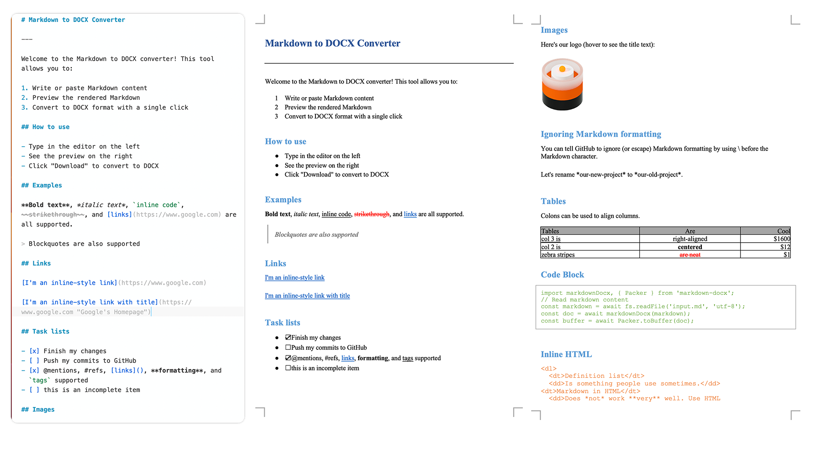

# markdown-docx

Convert Markdown files to DOCX format with support for both browser and Node.js environments.

将 Markdown 文件转换为 DOCX 格式，支持浏览器和 Node.js 环境。

[](https://www.npmjs.com/package/markdown-docx)
[](https://github.com/vace/markdown-docx/blob/main/LICENSE)

## Online Demo

[Markdown to DOCX Converter](https://md-docx.vace.me)

## Features



- 📝 Convert Markdown to DOCX format with high fidelity
- 🖼️ Support for images (with automatic downloading)
- 📋 Support for tables, lists, code blocks, and other Markdown elements
- 🔗 Hyperlinks and footnotes support
- 🧮 Mathematical equations (LaTeX via KaTeX): inline `$...$`, display `$$...$$`, and fenced ```math/latex/katex```; supports fractions, roots, subscripts/superscripts, sums/integrals with limits, and matrices
- 💅 Customizable styling options
- 🌐 Works in both browser and Node.js environments
- 🖥️ Command-line interface available

## Installation

```bash
# Using npm
npm install markdown-docx

# Using yarn
yarn add markdown-docx

# Using pnpm
pnpm add markdown-docx
```

## Basic Usage

### Node.js

```javascript
import fs from 'node:fs/promises';
import markdownDocx, { Packer } from 'markdown-docx';

async function convertMarkdownToDocx() {
  // Read markdown content
  const markdown = await fs.readFile('input.md', 'utf-8');

  // Convert to docx
  const doc = await markdownDocx(markdown);

  // Save to file
  const buffer = await Packer.toBuffer(doc);
  await fs.writeFile('output.docx', buffer);

  console.log('Conversion completed successfully!');
}

convertMarkdownToDocx();
```

### Browser

```javascript
import markdownDocx, { Packer } from 'markdown-docx';

async function convertMarkdownToDocx(markdownText) {
  // Convert to docx
  const doc = await markdownDocx(markdownText);

  // Generate blob for download
  const blob = await Packer.toBlob(doc);

  // Create download link
  const url = URL.createObjectURL(blob);
  const a = document.createElement('a');
  a.href = url;
  a.download = 'document.docx';
  a.click();

  // Clean up
  URL.revokeObjectURL(url);
}

// Example usage with a textarea
document.getElementById('convert-btn').addEventListener('click', () => {
  const markdown = document.getElementById('markdown-input').value;
  convertMarkdownToDocx(markdown);
});
```

### Skills

```sh
npx skills add vace/markdown-docx
```

This skill provides seamless conversion of Markdown files to Microsoft Word DOCX format.
Perfect for transforming documentation, notes, and reports into professional Word documents.

## Advanced Usage

### Using the MarkdownDocx Class

For more control over the conversion process, you can use the `MarkdownDocx` class directly:

```javascript
import { MarkdownDocx, Packer } from 'markdown-docx';
import fs from 'node:fs/promises';

async function convertWithOptions() {
  const markdown = await fs.readFile('input.md', 'utf-8');

  // Create instance with options
  const converter = new MarkdownDocx(markdown)

  // Generate document
  const doc = await converter.toDocument({
    title: 'My Document',
    creator: 'markdown-docx',
    description: 'Generated from Markdown'
  });

  // Save to file
  const buffer = await Packer.toBuffer(doc);
  await fs.writeFile('output.docx', buffer);
}
```

## Configuration Options

The `MarkdownDocx` constructor and `markdownDocx` function accept an options object with the following properties:

| Option | Type | Default | Description |
|--------|------|---------|-------------|
| `imageAdapter` | Function | Built-in adapter | Custom function to handle image processing |
| `ignoreImage` | Boolean | `false` | When set to `true`, images in markdown will be ignored |
| `ignoreFootnote` | Boolean | `false` | When set to `true`, footnotes will be ignored |
| `ignoreHtml` | Boolean | `false` | When set to `true`, inline HTML will be ignored |
| `gfm` | Boolean | `true` | Enable GitHub Flavored Markdown support |
| `theme` | Object | Default theme | Custom theme configuration for colors and sizes |

Additional options from the [marked](https://marked.js.org/using_advanced) library are also supported.

### Math options

```ts
interface MathOptions {
  engine?: 'builtin' | 'katex' // default: 'katex'
  katexOptions?: Record<string, any>
  // Prefer constructs that render reliably in LibreOffice
  libreOfficeCompat?: boolean
}
```

Example:

```ts
const doc = await markdownDocx(markdown, {
  math: {
    engine: 'katex',
    libreOfficeCompat: false // set true if LibreOffice rendering looks off
  }
})
```

### Theme options

You can customize the appearance of the generated document by providing a theme configuration:

```ts
const docx = await markdownToDocx(markdownText, {
  theme: {
    // Colors (hex values without #)
    heading1: "5B21B6",
    heading2: "7C3AED",
    heading3: "8B5CF6",
    heading4: "374151",
    heading5: "374151",
    heading6: "374151",
    link: "00fb0a",
    code: "EC4899",
    blockquote: "6B7280",
    del: "EF4444",

    // Font sizes (in points)
    heading1Size: 66,
    heading2Size: 52,
    heading3Size: 42,
    spaceSize: 18,
    codeSize: 20,
    linkUnderline: false,
    bodySize: 14,
    lineSpacing: 1.5,

    // Page margins — CSS shorthand (pt or cm), or verbose properties
    margin: "2cm 2.5cm",        // top/bottom 2cm, left/right 2.5cm
    // marginTop: "3cm",        // verbose properties override shorthand
    // marginRight: 72,         // plain number = pt
    // marginBottom: "2cm",
    // marginLeft: 72,

    // Remove blank-line paragraphs between content blocks
    collapseEmptyLines: false,

    linkUnderline: true,
  }
})
```

All theme properties are optional — override only what you need. See [`examples/sample-config.json`](./examples/sample-config.json) for a complete list with defaults.

#### Theme property reference

| Property | Type | Default | Description |
|---|---|---|---|
| `heading1`–`heading6` | `string` | (various) | Hex color (no `#`) for each heading level |
| `link` | `string` | `"0563C1"` | Hex color for hyperlinks |
| `code` | `string` | `"032F62"` | Hex color for code blocks |
| `codespan` | `string` | `"70AD47"` | Hex color for inline code |
| `codeBackground` | `string` | `"f6f6f7"` | Background fill for code blocks |
| `blockquote` | `string` | `"666666"` | Text color for blockquotes |
| `blockquoteBackground` | `string` | `"F9F9F9"` | Background fill for blockquotes |
| `del` | `string` | `"FF0000"` | Hex color for strikethrough text |
| `hr` | `string` | `"D9D9D9"` | Hex color for horizontal rules |
| `html` | `string` | `"4472C4"` | Hex color for raw HTML blocks |
| `heading1Size`–`heading6Size` | `number` | 18/16/14/13/12/12 | Font size in pt for each heading |
| `bodySize` | `number` | `12` | Base body font size in pt |
| `codeSize` | `number` | `11` | Font size in pt for code blocks |
| `lineSpacing` | `number` | `1.0` | Line spacing multiplier (e.g. `1.5` = 150%) |
| `linkUnderline` | `boolean` | `true` | Whether links are underlined |
| `margin` | `string \| number` | — | Page margin shorthand (see below) |
| `marginTop` | `number \| string` | — | Top margin; overrides `margin` |
| `marginRight` | `number \| string` | — | Right margin; overrides `margin` |
| `marginBottom` | `number \| string` | — | Bottom margin; overrides `margin` |
| `marginLeft` | `number \| string` | — | Left margin; overrides `margin` |
| `collapseEmptyLines` | `boolean` | `false` | Omit blank-line separator paragraphs |

#### Page margins

Margins follow CSS shorthand notation. Values may be plain numbers (treated as **pt**) or strings with a `pt` or `cm` suffix.

| Pattern | Meaning |
|---|---|
| `"2cm"` or `72` | All sides equal |
| `"2cm 1.5cm"` | Top & bottom = 2 cm, left & right = 1.5 cm |
| `"2cm 1.5cm 1cm"` | Top 2 cm, left/right 1.5 cm, bottom 1 cm |
| `"2cm 1.5cm 1cm 1.5cm"` | Top, right, bottom, left |

Verbose properties (`marginTop`, `marginRight`, `marginBottom`, `marginLeft`) override the shorthand when both are specified. They accept either a plain number (pt) or a string with `pt`/`cm` suffix.

```ts
theme: {
  margin: "2cm",        // base: 2 cm on all sides
  marginTop: "3cm",     // override top only
  marginLeft: 72,       // override left to 72 pt
}
```


## Command Line Interface

markdown-docx includes a CLI tool for converting markdown files from the command line:

```bash
# Install globally
npm install -g markdown-docx

# Basic usage
markdown-docx --input input.md --output output.docx

# Short form
markdown-docx -i input.md -o output.docx
```

If the output file is not specified, it will use the input filename with a `.docx` extension.

### Customizing Output via CLI

**Theme overrides** (inline JSON via `-t`):

```bash
# Hex color values WITHOUT the # prefix; sizes in points
markdown-docx -i input.md -t '{"heading1":"2F5597","bodySize":14,"lineSpacing":1.5}'
```

**Config file** (`-c`) for full control:

```bash
markdown-docx -i input.md -c my-config.json
```

Example `my-config.json`:

```json
{
  "ignoreImage": false,
  "math": { "engine": "katex", "libreOfficeCompat": false },
  "theme": {
    "heading1": "2F5597",
    "bodySize": 14,
    "lineSpacing": 1.5,
    "linkUnderline": false
  }
}
```

See [`examples/sample-config.json`](./examples/sample-config.json) for a complete list of all configurable properties with their defaults.

For a full property reference from the terminal:

```bash
markdown-docx help theme    # all theme color/size properties and defaults
markdown-docx help config   # all config file options and defaults
```

## Supported Markdown Features

- Headings (H1-H6)
- Paragraphs and line breaks
- Emphasis (bold, italic, strikethrough)
- Lists (ordered and unordered)
- Links and images
- Blockquotes
- Code blocks
- Tables
- Horizontal rules
- Footnotes
- Task lists (checkboxes)
- **Mathematical equations (LaTeX)** - inline and block equations

## Mathematical Equations

The library supports LaTeX-style mathematical equations using the `$` delimiter for inline math and `$$` for block equations.

### Inline Math

Use single dollar signs for inline equations:

```markdown
Einstein's famous equation is $E=mc^2$.
The Pythagorean theorem: $a^2 + b^2 = c^2$.
```

### Block Math

Use double dollar signs for display equations:

```markdown
$$
E=mc^2
$$

$$
\alpha + \beta + \gamma = \pi
$$
```

### Fenced Math Blocks

You can also use fenced code blocks labeled `math`, `latex`, or `katex` for display equations:

```markdown
```math
\left( \sum_{k=1}^n a_k b_k \right)^2 \leq \left( \sum_{k=1}^n a_k^2 \right) \left( \sum_{k=1}^n b_k^2 \right)
```
```


### Supported Features

- **Superscripts**: `$x^2$`, `$e^{10}$`
- **Subscripts**: `$x_1$`, `$a_{10}$`
- **Greek letters**: `$\alpha$`, `$\beta$`, `$\gamma$`, `$\pi$`, `$\omega$`, etc.
- **Operators**: `$\times$`, `$\div$`, `$\pm$`, `$\mp$`
- **Relations**: `$\leq$`, `$\geq$`, `$\neq$`, `$\approx$`, `$\equiv$`
- **Special symbols**: `$\infty$`, `$\in$`, `$\notin$`

By default, equations are rendered via KaTeX (LaTeX → MathML → native Word math/OMML) for broad coverage.

You can opt out to the lightweight builtin renderer (LaTeX → Unicode) if you prefer minimal output:


```ts
import markdownDocx, { Packer } from 'markdown-docx'

// Fallback to builtin (simple text) renderer
const doc = await markdownDocx(markdown, {
  math: { engine: 'builtin' }
})
```

### LibreOffice compatibility

LibreOffice has partial OMML support. If equations look wrong in LibreOffice, enable a compatibility mode that favors simpler constructs:

```ts
import markdownDocx, { Packer } from 'markdown-docx'

const doc = await markdownDocx(markdown, {
  math: {
    engine: 'katex',
    libreOfficeCompat: true
  }
})
```

- Sums/integrals render as operator with sub/superscripts (instead of native n-ary)
- Matrices render as a bracketed form (instead of true OMML matrix)
- Word still renders these fine; this mode mainly improves LibreOffice rendering


With KaTeX (default), structures like `\frac{a}{b}`, `x^{2}`, `x_{i}`, `\sqrt{x}`, `\sum`/`\int` with limits, and basic matrices render as native Word math.

## Image Adapter

The library provides a built-in image adapter that automatically downloads images from URLs. You can also create a custom image adapter by implementing the `ImageAdapter` interface.
The adapter should have a `getImage` method that takes an image URL and returns a Promise that resolves to an object containing the image data.

```ts
const imageAdapter: (token: Tokens.Image) => Promise<null | MarkdownImageItem>
```

### Custom Image Size

You can specify custom image dimensions in the Markdown image title attribute using the format `widthxheight` (e.g., `600x400` or `30%x30%`). This will override the original image dimensions when rendering in the DOCX document, which is useful for controlling image size and avoiding Word's maximum width constraints.

```markdown


```

The custom dimensions will be applied to the image in the generated DOCX file, while the original image data remains unchanged.

## Customization

You can customize the styling of the generated DOCX by accessing the style components:

```javascript
import { styles, colors, classes, numbering } from 'markdown-docx';

// Example: customize docs link color
styles.default.hyperlink.run.color = '0077cc';
styles.markdown.code.run.color = '000000';
```

You can refer to the files in `src/styles` to write your own styles.

- [styles.ts](./src/styles//styles.ts) - Default styles for the document
- [colors.ts](./src/styles/colors.ts) - Color definitions
- [markdown.ts](./src/styles/markdown.ts) - Markdown-specific styles

## Browser vs Node.js

The library automatically detects the environment and uses the appropriate image adapter:

- In the browser, images are fetched using the Fetch API
- In Node.js, images are downloaded using the built-in HTTP/HTTPS modules

## Examples

For more examples, see the [tests directory](https://github.com/vace/markdown-docx/tree/main/tests) in the repository.

## License

This project is licensed under the MIT License - see the LICENSE file for details.

## Related Projects

- [docx](https://github.com/dolanmiu/docx) - The underlying library for creating DOCX files
- [marked](https://github.com/markedjs/marked) - The Markdown parser used in this project